# Stock Market Data Analysis & Visualization

A comprehensive R script that fetches daily adjusted closing prices for a selection of major tickers from Yahoo Finance and generates a suite of exploratory and analytical plots, including moving averages, returns, volatility, cumulative performance, and comparative normalized charts.

> Author: [David Nguyen](https://github.com/hoangsonww)

## Table of Contents

1. [Project Overview](#project-overview)  
2. [Features & Plots](#features--plots)  
3. [Prerequisites](#prerequisites)  
4. [Installation](#installation)  
5. [Usage](#usage)  
6. [Script Breakdown](#script-breakdown)  
7. [Selected Visualizations](#selected-visualizations)  
8. [Interpreting the Outputs](#interpreting-the-outputs)  
9. [Extending & Customizing](#extending--customizing)  
10. [Data Source & Citations](#data-source--citations)  
11. [License](#license)  

---

## Project Overview

This repository provides a single R script (`Stock_Market_Analysis.R`) which:

- **Automatically installs** required packages (`quantmod`, `PerformanceAnalytics`, `zoo`) if missing  
- **Downloads** daily adjusted closing prices for tickers (`AAPL`, `MSFT`, `GOOG`, `AMZN`, `TSLA`, `NFLX`, `NVDA`)  
- **Computes** 20-day & 50-day simple moving averages, daily log returns, 20-day rolling volatility, and monthly returns  
- **Renders** 43 separate plots, each saved as `plot-<n>.png` in the working directory  
- **Performs** a final comparative normalized performance chart (base = 100)

---

## Features & Plots

1. **Price Chart with SMAs**  
2. **Daily Log Returns Time Series**  
3. **Histogram of Daily Returns**  
4. **20-Day Rolling Volatility**  
5. **Cumulative Returns**  
6. **Monthly Returns Boxplot**  
7. **Comparative Normalized Performance**  

Each ticker produces six individual plots, plus one comparative chart, for a total of **43** PNG files.

---

## Prerequisites

- **R** (version ≥ 4.0)  
- Internet connection to fetch data from Yahoo Finance  

---

## Installation

1. **Clone** this repository:  
   ```bash
   git clone https://github.com/yourusername/stock-market-analysis.git
   cd stock-market-analysis
   ```

2. **Open** R or RStudio in this folder.

---

## Usage

In an R console or RStudio:

```r
# Source the analysis script
source("Stock_Market_Analysis.R")
```

The script will:

1. Install any missing packages.
2. Download and process each ticker’s data.
3. Display each plot interactively (with a white background).
4. Save each plot as `plot-1.png` … `plot-43.png` in the project directory.
5. Print summary statistics for each ticker’s returns.

---

## Script Breakdown

1. **Setup**

   * Defines and installs package list
   * Loads libraries

2. **Data Fetch & Preparation**

   * Defines tickers & date range
   * Downloads via `quantmod::getSymbols()`
   * Extracts adjusted close, SMAs, returns, volatility, monthly returns

3. **Plotting Sections (per ticker)**

   * **Price + SMAs**
   * **Daily Returns**
   * **Histogram of Returns**
   * **Rolling Volatility**
   * **Cumulative Returns**
   * **Monthly Returns Boxplot**

4. **Comparative Performance**

   * Merges all adjusted series
   * Normalizes each to 100 at the first date
   * Plots on a single chart with legend

5. **Summary Statistics**

   * Prints mean, SD, skewness, kurtosis, etc., via `PerformanceAnalytics::table.Stats()`

---

## Selected Visualizations

Below are some of the 43 plots generated to visualize the stock market data better:

### Apple Stock (AAPL)

<p align="center">
  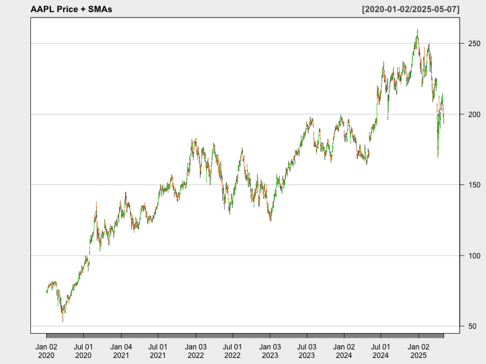
</p>
<p align="center">
  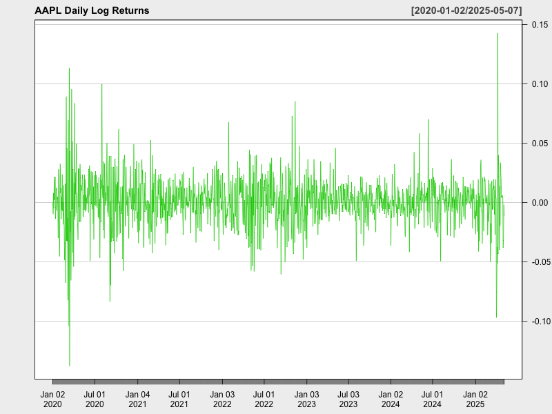
</p>
<p align="center">
  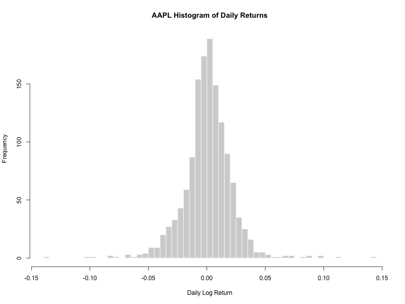
</p>
<p align="center">
  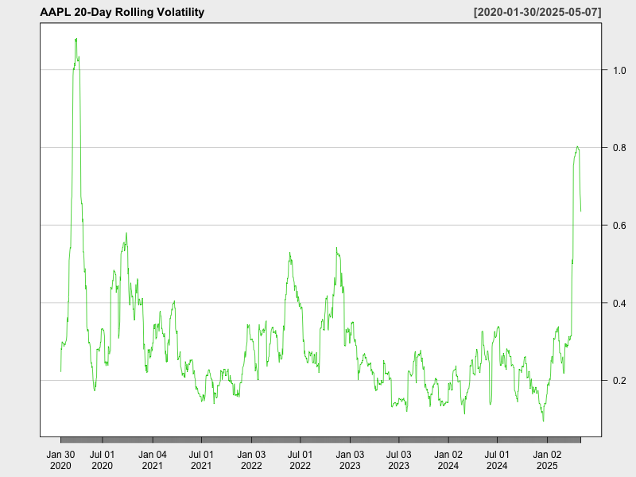
</p>
<p align="center">
  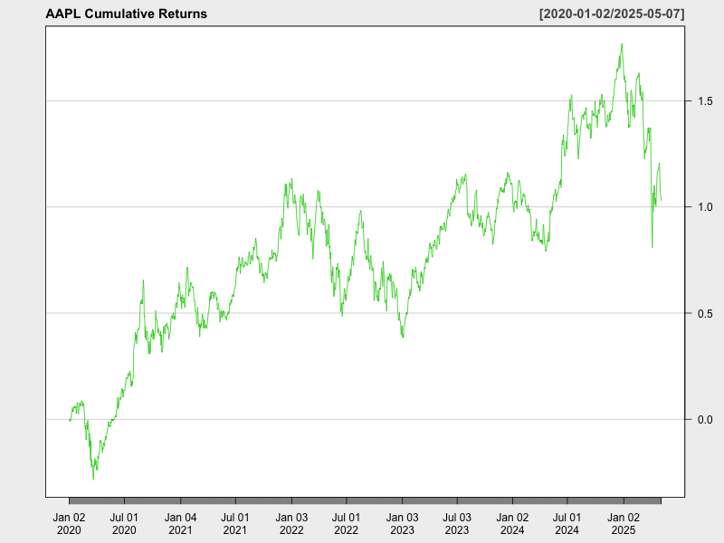
</p>
<p align="center">
  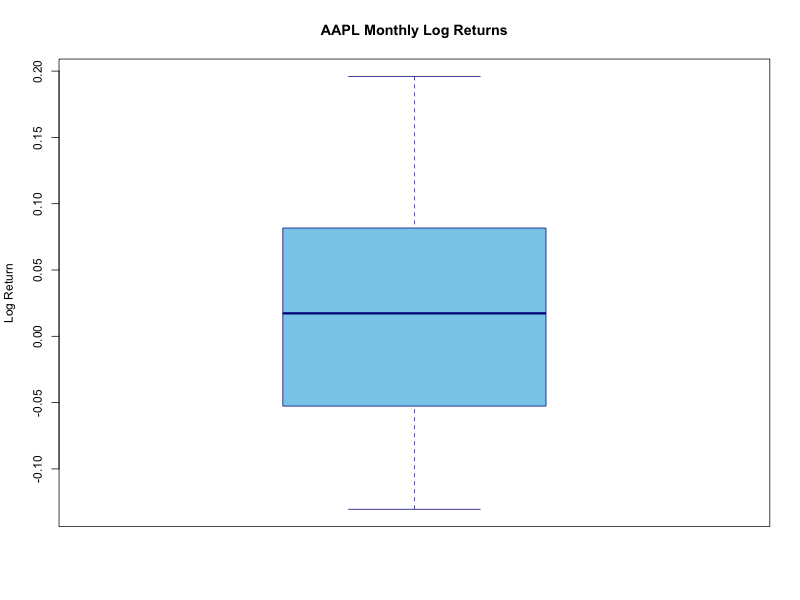
</p>

### Microsoft Stock (MSFT)

<p align="center">
  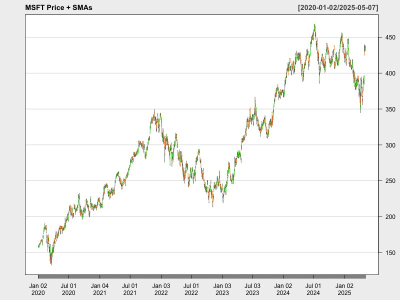
</p>
<p align="center">
  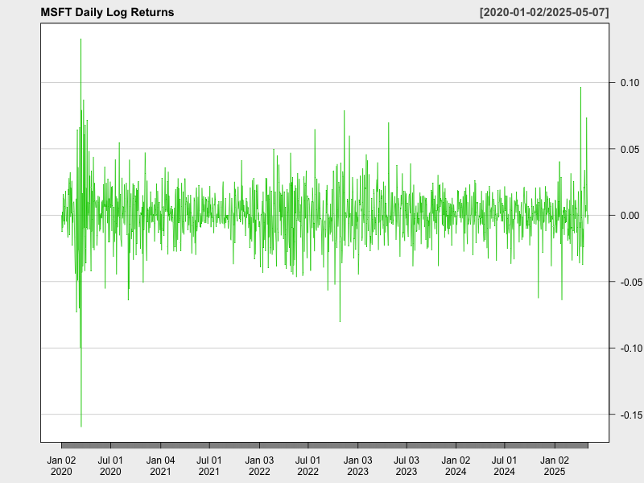
</p>
<p align="center">
  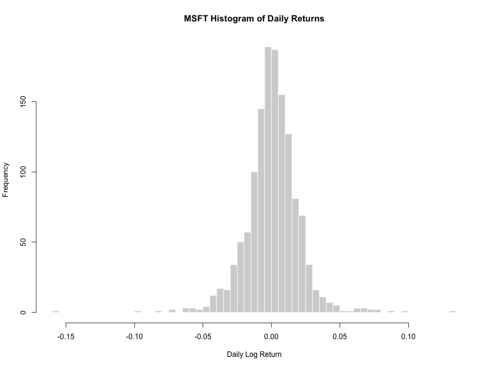
</p>
<p align="center">
  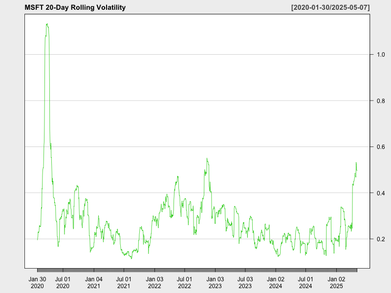
</p>
<p align="center">
  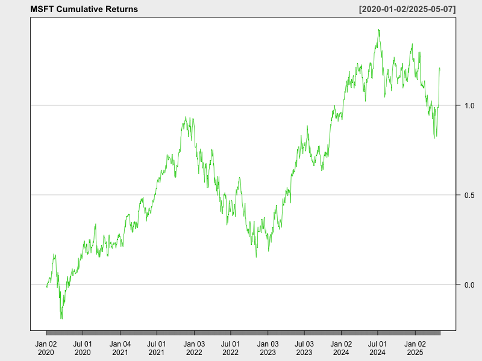
</p>
<p align="center">
  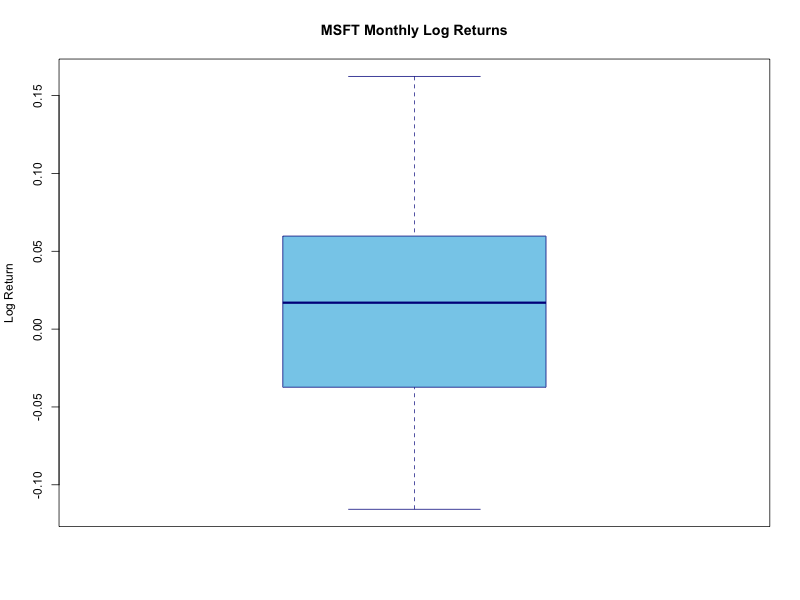
</p>

---

## Interpreting the Outputs

* **SMAs vs. Price:** Identify trends and potential crossovers
* **Returns Series & Histogram:** Assess volatility clustering & distribution shape
* **Rolling Volatility:** Track risk over time (annualized)
* **Cumulative Returns:** Evaluate total growth from start date
* **Monthly Boxplot:** Compare variability across months
* **Normalized Chart:** Compare relative performance on a common scale

---

## Extending & Customizing

* **Add tickers:** Update `tickers <- c(...)`
* **Change SMAs:** Modify `n` in `SMA()` calls
* **Alternative returns:** Use `type = "arithmetic"` in `dailyReturn()`
* **Additional analytics:** Compute drawdowns, Sharpe ratios via `PerformanceAnalytics`
* **Export formats:** Switch `png()` to `pdf()` or `svg()`

---

## Data Source & Citations

* **Yahoo Finance** (via `quantmod::getSymbols`)
* **R & Packages:**

  * R Core Team (2023). R: A language and environment for statistical computing.
  * Jeffrey Ryan and Jim Lemon et al., *quantmod* package.
  * Brian Peterson, *PerformanceAnalytics* package.

---

## License

Distributed under the MIT License. See [LICENSE](LICENSE) for details.
