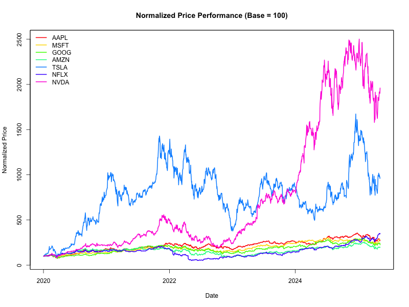

```{r setup, include=FALSE}
knitr::opts_chunk$set(
  echo      = TRUE,
  warning   = FALSE,
  message   = FALSE,
  fig.align = "center",
  fig.width = 10,
  fig.height = 6
)
````

# Project Overview

This analysis fetches daily adjusted closing prices for a set of major tickers from Yahoo Finance, computes moving averages, returns, volatility, and generates a suite of plots. All figures are rendered inline and also saved as PNG files.

# Dependencies

```{r libs}
pkgs <- c("quantmod", "PerformanceAnalytics", "zoo")
for(pkg in pkgs) {
  if (!requireNamespace(pkg, quietly = TRUE)) install.packages(pkg)
  library(pkg, character.only = TRUE)
}
```

# 1. Parameters

```{r params}
tickers    <- c("AAPL","MSFT","GOOG","AMZN","TSLA","NFLX","NVDA")
start_date <- as.Date("2020-01-01")
end_date   <- Sys.Date()
img_dir    <- "img"
dir.create(img_dir, showWarnings = FALSE)
```

# 2. Data Retrieval & Processing

```{r fetch}
getSymbols(tickers, src = "yahoo",
           from = start_date, to = end_date,
           auto.assign = TRUE)
```

Define a helper to save each plot with incrementing index:

```{r saver}
plot_index <- 1
save_plot <- function(fig) {
  file <- file.path(img_dir, sprintf("plot-%02d.png", plot_index))
  ggplot2::ggsave(file, fig, width = 10, height = 6, bg = "white")
  assign("plot_index", plot_index + 1, envir = .GlobalEnv)
}
```

Processing function:

```{r process}
process_symbol <- function(sym) {
  adj    <- Ad(get(sym))
  sma20  <- SMA(adj, n = 20)
  sma50  <- SMA(adj, n = 50)
  ret    <- dailyReturn(adj, type = "log")
  vol20  <- runSD(ret, n = 20) * sqrt(252)
  mo_ret <- monthlyReturn(adj, type = "log")
  list(adj = adj, sma20 = sma20, sma50 = sma50,
       ret = ret, vol20 = vol20, mo_ret = mo_ret)
}
stock_data <- setNames(lapply(tickers, process_symbol), tickers)
```

# 3. Per–Ticker Visualizations

We iterate through each ticker and produce six figures:

```{r per-ticker, results='hide'}
library(ggplot2)
for(sym in tickers) {
  d <- stock_data[[sym]]
  
  ## 3.1 Price + SMAs
  p1 <- chartSeries(get(sym),
            name  = paste(sym, "Price + SMAs"),
            TA    = NULL,
            theme = chartTheme("white"))
  addTA(d$sma20, on = 1, col = "blue", lwd = 1.5)
  addTA(d$sma50, on = 1, col = "red",  lwd = 1.5)
  
  ## save via quantmod → grab last plot
  dev.copy(png, filename = file.path(img_dir, sprintf("plot-%02d.png", plot_index)),
           width=800, height=480)
  dev.off()
  plot_index <<- plot_index + 1
  
  ## 3.2 Daily Returns
  p2 <- chartSeries(d$ret,
            name  = paste(sym, "Daily Log Returns"),
            TA    = NULL,
            theme = chartTheme("white"))
  dev.copy(png, file.path(img_dir, sprintf("plot-%02d.png", plot_index)), width=800, height=480); dev.off()
  plot_index <<- plot_index + 1
  
  ## 3.3 Histogram of Returns
  p3 <- ggplot(data.frame(ret = coredata(d$ret)), aes(ret)) +
    geom_histogram(bins = 50, fill="lightgray", color="white") +
    labs(title = paste(sym, "Histogram of Daily Returns"),
         x = "Daily Log Return", y = "Frequency") +
    theme_minimal()
  print(p3); save_plot(p3)
  
  ## 3.4 Rolling Volatility
  p4 <- chartSeries(d$vol20,
            name  = paste(sym, "20-Day Rolling Volatility"),
            TA    = NULL,
            theme = chartTheme("white"))
  dev.copy(png, file.path(img_dir, sprintf("plot-%02d.png", plot_index)), width=800, height=480); dev.off()
  plot_index <<- plot_index + 1
  
  ## 3.5 Cumulative Returns
  cum_ret <- cumprod(1 + d$ret) - 1
  p5 <- chartSeries(cum_ret,
            name  = paste(sym, "Cumulative Returns"),
            TA    = NULL,
            theme = chartTheme("white"))
  dev.copy(png, file.path(img_dir, sprintf("plot-%02d.png", plot_index)), width=800, height=480); dev.off()
  plot_index <<- plot_index + 1
  
  ## 3.6 Monthly Return Boxplot
  df_mo <- data.frame(mo = coredata(d$mo_ret))
  p6 <- ggplot(df_mo, aes(factor(format(index(d$mo_ret), "%Y-%m")), mo)) +
    geom_boxplot(fill="skyblue", color="darkblue") +
    labs(title = paste(sym, "Monthly Log Returns"),
         x = "Month", y = "Log Return") +
    theme_minimal() +
    theme(axis.text.x = element_text(angle=90, vjust=0.5))
  print(p6); save_plot(p6)
}
```

# 4. Comparative Normalized Performance

```{r comparative}
# merge adjusted closes
adj_all <- do.call(merge, lapply(stock_data, `[[`, "adj"))
colnames(adj_all) <- tickers
norm_prices <- sweep(adj_all, 2, as.numeric(adj_all[1,]), FUN="/") * 100

# plot.TimeSeries from PerformanceAnalytics
chart.TimeSeries(norm_prices,
                 main       = "Normalized Price Performance (Base = 100)",
                 legend.loc = "topleft",
                 col        = rainbow(length(tickers)),
                 lwd        = 2,
                 SSL        = FALSE,
                 grid.col   = "white",
                 legend.names = tickers)
dev.copy(png, file.path(img_dir, sprintf("plot-%02d.png", plot_index)), width=800, height=480); dev.off()
plot_index <<- plot_index + 1
```

# 5. Summary Statistics

```{r stats}
for(sym in tickers) {
  cat("\n##", sym, "\n")
  print(table.Stats(stock_data[[sym]]$ret))
}
```

# Selected Figures

<p align="center">
  
</p>
<p align="center">
  
</p>
<p align="center">
  
</p>
<p align="center">
  
</p>

# Interpretation & Next Steps

* **Moving Averages** highlight trend shifts.
* **Returns & Volatility** reveal risk patterns.
* **Cumulative & Normalized** charts facilitate cross‐ticker comparison.
* Extend by adding indicators (RSI, MACD), alternative timeframes, or portfolio simulations.
